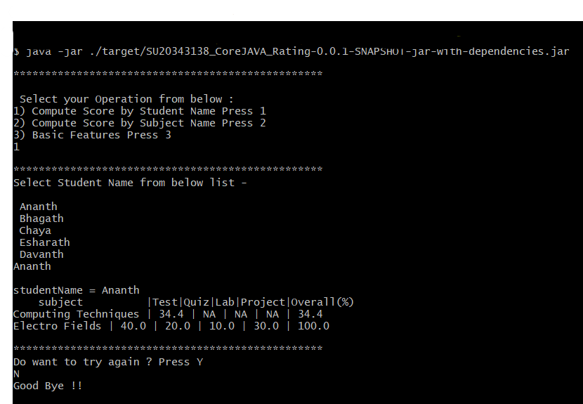

# Student Ratings Console Applications (With Out Database)

# Description

This is an Console Based Application which takes input from user and display result on Console. There is no Database
used all data is stored in Java collection

It covers following Scenario:

1) Compute & display student average score per assignment category &overall rating for assigned subject(s).
2) Compute & Display subject average score per assignment category &overall rating for assigned student(s).
3) Basic features.

    1) Add/remove assignment category with weights to an existing list.
    2) Display all assignment categories with their weights.
    3) CRUD operations for student enrollment to subject(s)with Assignment Category (Default values for date of
       submission and Point)

### Running Application Steps

1) mvn clean install -U
2) java -jar ./target/SU20343138_CoreJAVA_Rating-0.0.1-SNAPSHOT-jar-with-dependencies.jar

Refer the Screen shot for example output:

